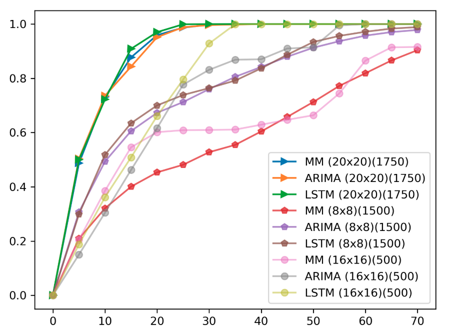

# A crime prediction tool based on Heterogeneous Clustering and an original evaluation metric



## Table of Contents
- [Introduction](#introduction)
- [Getting Started](#getting-started)


## Introduction

This tool implements a crime prediction algorithm in a geological space using heterogeneous clustering and an evaluation metric. The algorithm and the metric is proposed by the Data Science Lab at USC (http://dslab.usc.edu/).


## Getting Started

1. Install [Python]()
2. Install [Jupyter Notebook](http://jupyter.org/install) (only if you want to visualize the results)
3. Install all the packages listed in packages.txt. If you have [pip](https://pypi.org/project/pip/) installed, you could run `pip install -r packages.txt` to install all the packages.
4. Edit config.py for parameter settings:
    
    `ignoreFirst` - int: Minimum amount of training periods

    `periodsAhead_list` - List of ints: Periods ahead to forecast

    `ug_gridshapes` - List of tuples: # of cells along latitude & longitude (for uniform grid method)

    `ug_maxDist` - Leave at 0 (for uniform grid method)

    `ug_threshold` - Leave at 0 (for uniform grid method)

    `ug_methods` - List of str: Any of ["mm", "ar", "harmonic]. Forecasting algorithms to use (for uniform grid method)

    `c_gridshape` - Tuple: # of cells along latitude & longitude (for cluster method)

    `c_thresholds` - int: Threshold of clustering (for cluster method)

    `c_maxDist` - int: Neighborhood distance of clustering (for cluster method)

    `c_methods` - List of str: Any of ["mm", "ar", "harmonic]. Forecasting algorithms to use (for cluster method)

    `resource_indexes` - List of int: List of amount of  resources to use for evaluation (RA calculation)

    `cell_coverage_units` - int: Number of resources needed to cover each cell (RA calculation)

5. Sample usage for forecasting & evaluation (using `LAdata.pkl`):

    ```
    python parse_data.py DPSdata.pkl DPSUSC.pkl
    python make_predictions.py LAdata.pkl
    python calculate_resource_allocation.py
    python plot_allocations.py
    ````

